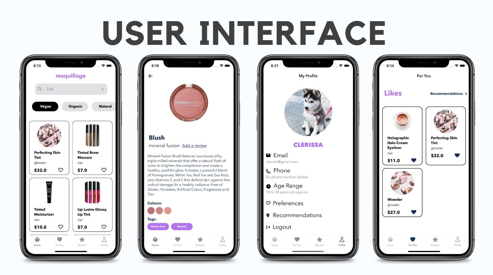

# Maquillage-React-Native

Maquillage is a content-based recommendation application that involves integration with a REST API. The app aims to serve as a platform for consumers that want to find organic and cruelty-free products by bringing them all in one place to ensure a hassle-free makeup hunting experience.

<p>
    
</p>

## Installation

Use the package manager npm to install dependencies.

``` npm install i  ```

Navigate to the ios folder and run,

``` pod install  ```

## Usage

To run the app on a simulator on IOS and Android respectively,

``` npm run ios ```

``` npm run android ```

## Features

1. Search: Search and filter products based on product category such as vegan, organic, oil-free, etc.

2. Recommendations: Personalized product recommendations based on skin type.

3. Likes: Products can be liked and viewed for later use.

4. Reviews: View detailed reviews about a product from other users.

## User Interface

<p>
    
</p>
